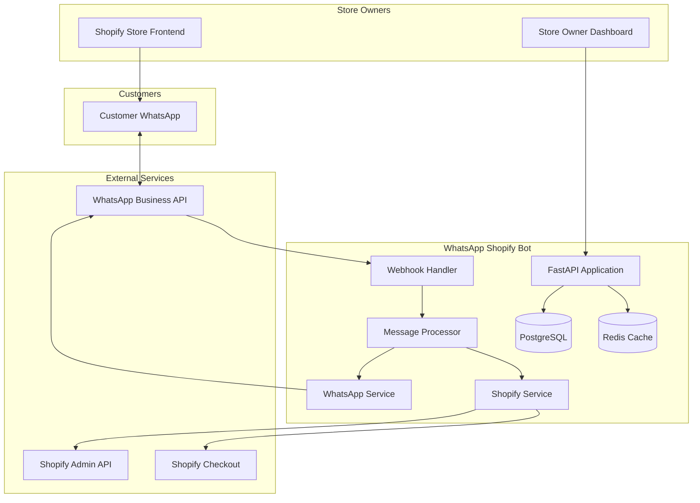
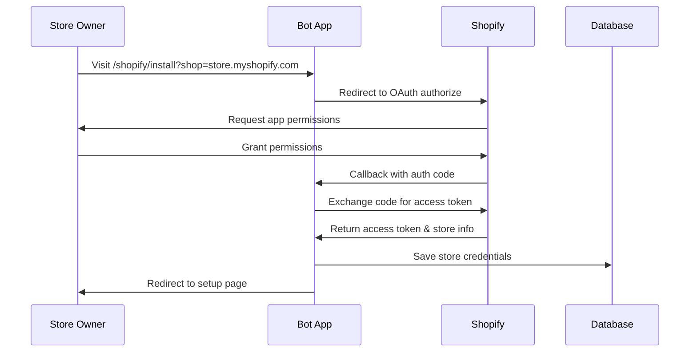
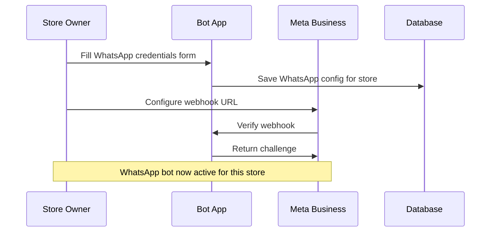
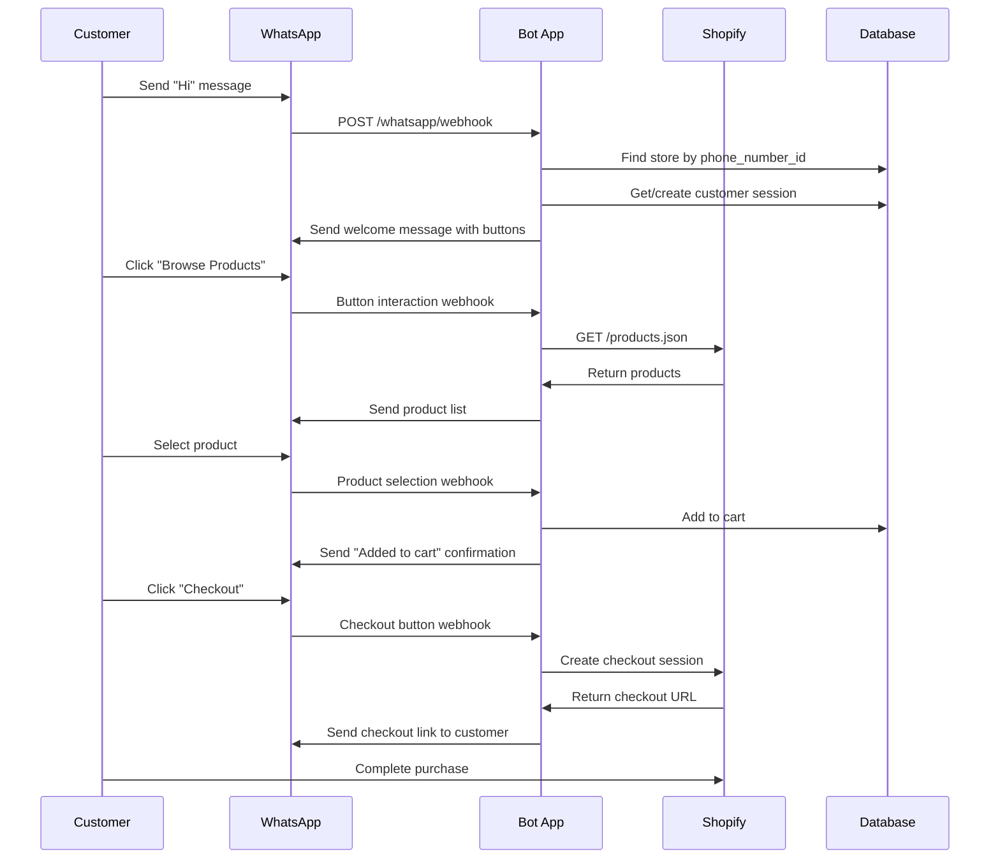
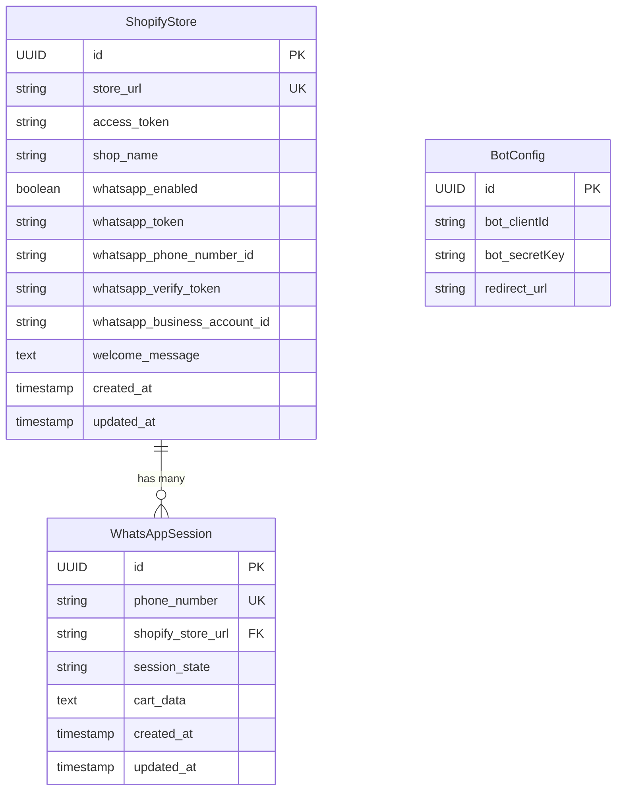

# 🏗️ Architecture Documentation

Comprehensive architecture overview of the WhatsApp Shopify Bot, including system design, data flow, and technical decisions.

## 🎯 System Overview

The WhatsApp Shopify Bot is a multi-tenant SaaS application that enables Shopify store owners to integrate WhatsApp shopping experiences into their stores. Each store operates independently with their own WhatsApp Business API credentials.

### **Core Concept**
```
Store Owner → Installs App → Configures WhatsApp → Customers Shop via WhatsApp
```

---

## 🏛️ High-Level Architecture



---

## 🎨 Application Architecture

### **Layer Structure**
```
┌─────────────────────────────────┐
│         Presentation Layer       │  ← FastAPI Routes, HTML Templates
├─────────────────────────────────┤
│         Business Logic Layer     │  ← Message Processing, Shopping Flow
├─────────────────────────────────┤
│         Service Layer           │  ← WhatsApp API, Shopify API
├─────────────────────────────────┤
│         Data Access Layer       │  ← Repositories, Database Models
├─────────────────────────────────┤
│         Infrastructure Layer    │  ← Database, Redis, Config
└─────────────────────────────────┘
```

### **Module Organization**
```
app/
├── core/                    # Infrastructure & Configuration
│   ├── config.py           # Environment settings
│   ├── database.py         # DB connection & sessions
│   └── redis.py            # Cache configuration
├── modules/
│   ├── botConfig/          # App-level configuration
│   └── whatsapp/           # Core WhatsApp functionality
│       ├── models.py       # Data models
│       ├── repository.py   # Data access
│       ├── service.py      # External API integration
│       ├── auth.py         # Shopify OAuth
│       ├── webhook.py      # WhatsApp webhook handling
│       └── processor.py    # Business logic
└── utils/                  # Shared utilities
```

---

## 🔄 Data Flow Architecture

### **1. Store Installation Flow**


### **2. WhatsApp Configuration Flow**


### **3. Customer Shopping Flow**


---

## 🗃️ Database Design

### **Entity Relationship Diagram**


### **Table Purposes**

1. **ShopifyStore**: 
   - Central store configuration
   - Shopify API credentials
   - WhatsApp API credentials (store-specific)
   - Customization settings

2. **WhatsAppSession**:
   - Customer conversation state
   - Shopping cart persistence
   - Session management

3. **BotConfig**:
   - App-level configuration
   - OAuth credentials

### **Data Relationships**
- One store can have many customer sessions
- Each session belongs to one store
- Store identification via `whatsapp_phone_number_id`
- Session identification via customer `phone_number`

---

## 🔧 Service Architecture

### **WhatsAppService**
**Purpose**: Interface with WhatsApp Business API

**Responsibilities**:
- Send text/interactive messages
- Handle message formatting
- Manage WhatsApp API authentication
- Error handling and retries

**Configuration**: Store-specific credentials
```python
WhatsAppService(store_config) → Uses store.whatsapp_token
```

### **ShopifyService**  
**Purpose**: Interface with Shopify Admin API

**Responsibilities**:
- Fetch product catalog
- Create checkout sessions
- Handle API rate limits
- Clean HTML content from product descriptions

**Configuration**: Store-specific access token
```python
ShopifyService(store.store_url, store.access_token)
```

### **MessageProcessor**
**Purpose**: Business logic for conversation flow

**Responsibilities**:
- Parse incoming messages
- Manage conversation state
- Orchestrate shopping flow
- Handle button interactions

**State Management**:
- `browsing`: Default menu state
- `cart`: Cart management
- `checkout`: Purchase flow

---

## 🔒 Security Architecture

### **Authentication Layers**

1. **Shopify OAuth**:
   - PKCE flow for secure authorization
   - State parameter for CSRF protection
   - Access token storage per store

2. **WhatsApp Webhook Verification**:
   - HMAC signature validation
   - Challenge-response verification
   - Store-specific verify tokens

3. **Internal Security**:
   - Environment variable isolation
   - Database credential protection
   - Secure session management

### **Multi-Tenancy Security**
```python
# Store isolation by phone_number_id
store = await repo.get_store_by_phone_number(phone_number_id)

# Each store uses own credentials
whatsapp_service = WhatsAppService(store)
shopify_service = ShopifyService(store.store_url, store.access_token)
```

### **Data Protection**
- No cross-store data access
- Encrypted credential storage
- Secure webhook handling
- Input validation on all endpoints

---

## 📡 API Architecture

### **RESTful Design**
```
GET    /shopify/install          # Initiate installation
GET    /shopify/callback         # OAuth callback
GET    /shopify/setup            # Configuration form
POST   /shopify/configure        # Save configuration
GET    /shopify/admin            # Dashboard

GET    /whatsapp/webhook         # Webhook verification
POST   /whatsapp/webhook         # Message processing
```

### **Async Processing**
- All database operations are async
- Non-blocking HTTP requests
- Concurrent message processing
- Efficient resource utilization

### **Error Handling Strategy**
```python
try:
    await process_message()
except ShopifyAPIError:
    # Handle Shopify-specific errors
except WhatsAppAPIError:
    # Handle WhatsApp-specific errors
except Exception as e:
    # Log error and send generic response
    logger.error(f"Unexpected error: {e}")
```

---

## 🚀 Scalability Architecture

### **Horizontal Scaling**
- Stateless application design
- Session data in external database
- Shared Redis for caching
- Load balancer compatible

### **Database Scaling**
- Async database connections
- Connection pooling
- Read replica support
- Partitioning by store_url

### **Caching Strategy**
```
Redis Cache:
├── Store configurations (store_url → config)
├── Product catalog (store_url → products)
├── Session data (phone_number → session)
└── Rate limiting counters
```

### **Queue Architecture** (Future Enhancement)
```
Message Queue:
├── Webhook processing queue
├── Shopify API calls queue  
├── WhatsApp API calls queue
└── Background tasks queue
```

---

## 🔄 Event-Driven Architecture

### **Webhook Events**
1. **WhatsApp → Bot**:
   - Message received
   - Button clicked
   - List item selected

2. **Shopify → Bot**:
   - App installed/uninstalled
   - Store updated
   - Product changes

3. **Internal Events**:
   - Cart updated
   - Checkout created
   - Session expired

### **Event Processing Flow**
```
Webhook → Validation → Store Lookup → Service Init → Business Logic → Response
```

---

## 🏗️ Infrastructure Architecture

### **Development Environment**
```
Local Development:
├── PostgreSQL (local)
├── Redis (local)
├── ngrok (tunnel)
└── FastAPI dev server
```

### **Production Environment**
```
Production Stack:
├── Render Web Service
├── Render PostgreSQL
├── Redis Cloud/Render Redis
├── Custom domain (optional)
└── CDN for static files
```

### **Deployment Architecture**
```
GitHub → Render → Auto-deploy
├── Build: pip install -r requirements.txt
├── Start: uvicorn main:app --host 0.0.0.0 --port $PORT
├── Health checks: GET /
└── Environment variables from Render dashboard
```

---

## 🔍 Monitoring Architecture

### **Logging Strategy**
```python
# Structured logging
logger.info("Customer interaction", extra={
    "phone_number": phone_number,
    "store_url": store.store_url,
    "action": "product_view",
    "product_id": product_id
})
```

### **Metrics Collection**
- API response times
- Message processing latency
- Shopify API success rates
- WhatsApp delivery rates
- Database query performance

### **Health Checks**
```python
@app.get("/health")
async def health_check():
    return {
        "status": "healthy",
        "database": await check_database(),
        "redis": await check_redis(),
        "timestamp": datetime.utcnow()
    }
```

---

## 🚦 Performance Architecture

### **Optimization Strategies**

1. **Database**:
   - Async queries
   - Connection pooling
   - Proper indexing
   - Query optimization

2. **API Calls**:
   - Async HTTP clients
   - Request batching
   - Response caching
   - Circuit breakers

3. **Caching**:
   - Store configuration cache
   - Product data cache
   - Session cache
   - Response cache

### **Performance Metrics**
- Message processing time: < 200ms
- Database query time: < 50ms
- API response time: < 100ms
- Cache hit rate: > 80%

---

## 🔮 Future Architecture Considerations

### **Microservices Evolution**
```
Current Monolith → Future Microservices:
├── Auth Service (Shopify OAuth)
├── WhatsApp Service (Message handling)
├── Shopify Service (Product management)
├── Session Service (State management)
└── Analytics Service (Metrics & reporting)
```

### **Event Streaming**
- Apache Kafka for event streaming
- Event sourcing for audit trail
- CQRS for read/write separation

### **Advanced Features**
- AI-powered product recommendations
- Multi-language support
- Advanced analytics dashboard
- Automated marketing campaigns

---

This architecture documentation provides a comprehensive view of the system design, ensuring maintainability, scalability, and security as the application grows.